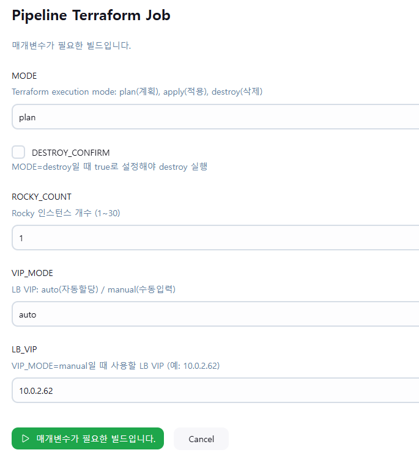

## Directory Structure

- provider.tf        : Cloud provider 설정
- versions.tf        : Terraform / Provider 버전 고정
- variables.tf       : 입력 변수 정의
- terraform.tfvars   : 환경별 실제 값 (로컬/Jenkins에서 별도 관리)
- instance.tf        : Compute 인스턴스 정의
- security_group.tf  : 보안그룹 및 포트 정책
- lb.tf              : Load Balancer 설정
- bastion.tf         : Bastion 호스트 구성
- outputs.tf         : 주요 리소스 출력값
- Jenkinsfile        : Jenkins Pipeline 정의 (`plan / apply / destroy`)

## 생성 리소스 (Terraform이 생성)
- Security Group 
    - ssh_sg(22)
    - service_sg(80)
- Backend Instance N개
    - mgmt_port: SSH/Ansible 관리용 NIC
    - service_port: 서비스 트래픽(LB 백엔드) NIC
### exposure_mode = "lb" 일 때 추가
- Bastion 인스턴스 1대 + Bastion FIP 1개
- Load Balancer 구성
    - Loadbalancer(VIP) + Listener + Pool + Health Monitor + Members(N개)
### exposure_mode = "fip" 일 때 추가
- 백엔드 mgmt 포트에 FIP N개 (서버별 1개)

## 전제 조건 (기존에 존재해야 하며 Terraform이 조회)
- VPC: `vpc_id`
- Subnet: `subnet_id`, `mgmt_subnet_id`, `service_subnet_id`
- Keypair: `keypair_name`
- Image / Flavor: `image_name`, `flavor_name`

## 사용자가 반드시 설정해야 하는 값
- Provider: `region`, `auth_url`, `tenant_id`, `user_name`, `password`
- Network: `vpc_id`, `vpc_name`, `subnet_id`, `subnet_shared`
- Instance: `keypair_name`, `flavor_name`, `image_name`, `backend_count`, `exposure_mode` *(`lb` 또는 `fip`)*
- Security: `my_ip_cidr` (예: `203.0.113.10/32`)
- Jenkins에서 Bastion SSH 접근이 필요한 경우:
  - `jenkins_allowed_cidr` (예: `198.51.100.25/32`)

- (LB 모드 사용 시)
  - `bastion_enabled` *(권장: `true` — LB 모드에서 SSH/Ansible 진입점 필요)*

- (선택) 서브넷 분리/고정 IP를 사용할 때만
  - `mgmt_subnet_id` *(관리 NIC용 서브넷 / 미지정 시 `subnet_id` 사용)*
  - `service_subnet_id` *(서비스 NIC/LB용 서브넷 / 미지정 시 `subnet_id` 사용)*
  - `backend_service_fixed_ips` *(서비스 NIC 고정 IP 리스트 — `service_subnet_id` CIDR 대역과 일치해야 함)*
  - `lb_vip_address` *(LB VIP 고정 — `service_subnet_id` CIDR 대역과 일치해야 함)*

## 보안 주의사항
다음 파일은 민감 정보를 포함할 수 있으므로 Git에 커밋해서는 안 됩니다.
- `terraform.tfvars`
- `terraform.tfstate`, `terraform.tfstate.backup`
- `.terraform/`

비밀번호(`password`)는 파일에 저장하지 않고 환경변수로 주입하는 방식을 권장합니다.
- PowerShell: `$env:TF_VAR_password="NHN_CLOUD_API_PASSWORD"`
- bash: `export TF_VAR_password="NHN_CLOUD_API_PASSWORD"`

다만 Jenkins Pipeline 실행 시에는 실제 환경값이 포함된 `terraform.tfvars`를
**사용자가 수동으로 업로드한 File Credential**로 주입하는 방식을 사용합니다.

## Jenkins Pipeline 실행 방식

  

이 프로젝트는 Jenkins에서 다음 모드로 실행할 수 있습니다.

- `plan`    : 변경 사항 미리 확인
- `apply`   : 리소스 생성/변경 적용
- `destroy` : 리소스 삭제

추가 파라미터 예시:
- `ROCKY_COUNT`
- `VIP_MODE`
- `LB_VIP`
- `DESTROY_CONFIRM`

### Jenkins에서 사용자가 수동으로 추가해야 하는 것
- 실제 환경값이 담긴 `terraform.tfvars` 파일
- Jenkins 등록 방식:
  - **Kind**: `Secret file`
  - **ID**: `terraform-tfvars`

즉, Git에는 예시/코드만 두고  
실제 `tenant_id`, `user_name`, `password`, `image_name`, `keypair_name`, `my_ip_cidr`,
`jenkins_allowed_cidr` 등의 값은 사용자가 작성한 `terraform.tfvars`를 Jenkins에 업로드하여 사용합니다.

## Terraform 실행 명령어
- `terraform fmt -recursive`
- `terraform validate`
- `terraform init`
- `terraform plan`
- `terraform apply`

## 리소스 삭제
- `terraform destroy`

### Outputs (terraform output)

- Endpoint
  - `service_endpoint`
    - `lb` 모드: LB VIP(서비스 고정 주소)
    - `fip` 모드: 대표 FIP(접근용 엔드포인트)

- Load Balancer (`lb` 모드일 때만)
  - `lb_vip` *(LB VIP 주소)*
  - `service_endpoint` *(= `lb_vip`)*
  
- Bastion (`lb` 모드 + `bastion_enabled=true`일 때만)
  - `bastion_fip` *(Bastion 공인 IP — SSH/Ansible 진입점)*

- Backend IPs (다중 서버 기준)
  - `backend_mgmt_private_ips` *(맵: 백엔드별 mgmt 사설 IP)*
  - `backend_service_private_ips` *(맵: 백엔드별 service 사설 IP)*

- Floating IPs (`fip` 모드일 때만)
  - `backend_mgmt_fips` *(맵: 백엔드별 mgmt 공인 IP)*

---

# NHN Cloud Terraform: Instance Provisioning on Existing VPC/Subnet

## Overview
This project is a Terraform (IaC) example that **provisions and manages a consistent set of instances** on NHN Cloud by **referencing existing VPCs and Subnets**.
By standardizing infrastructure as code, it minimizes configuration drift across environments and improves operational efficiency and reproducibility by tracking changes in version control.

## Directory Structure

- provider.tf        : Cloud provider configuration
- versions.tf        : Terraform and provider version constraints
- variables.tf       : Input variable definitions
- terraform.tfvars   : Environment-specific values (managed locally or injected from Jenkins)
- instance.tf        : Compute instance definitions
- security_group.tf  : Security groups and port policies
- lb.tf              : Load Balancer configuration
- bastion.tf         : Bastion host setup
- outputs.tf         : Key resource outputs
- Jenkinsfile        : Jenkins Pipeline definition (`plan / apply / destroy`)

## Resources Created (Provisioned by Terraform)
- Security Groups
  - `ssh_sg` (22)
  - `service_sg` (80)
- Backend Instances (N)
  - `mgmt_port`: management NIC for SSH/Ansible
  - `service_port`: service NIC for application traffic (LB backend)

### Additional resources when `exposure_mode = "lb"`
- Bastion instance (1) + Bastion Floating IP (1)
- Load Balancer
  - Load Balancer (VIP) + Listener + Pool + Health Monitor + Members (N)

### Additional resources when `exposure_mode = "fip"`
- Floating IPs on backend `mgmt_port` (N, one per server)

## Prerequisites (Must Exist and Will Be Looked Up by Terraform)
- VPC: `vpc_id`
- Subnets: `subnet_id`, `mgmt_subnet_id`, `service_subnet_id`
- Keypair: `keypair_name`
- Image / Flavor: `image_name`, `flavor_name`

## Required User Configuration
- Provider: `region`, `auth_url`, `tenant_id`, `user_name`, `password`
- Network: `vpc_id`, `vpc_name`, `subnet_id`, `subnet_shared`
- Instance: `keypair_name`, `flavor_name`, `image_name`, `backend_count`, `exposure_mode` *(`lb` or `fip`)*
- Security: `my_ip_cidr` (e.g., `203.0.113.10/32`)
- If Jenkins needs SSH access to Bastion:
  - `jenkins_allowed_cidr` (e.g., `198.51.100.25/32`)

### (When using LB mode)
- `bastion_enabled` *(recommended: `true` — required as an SSH/Ansible entry point in LB mode)*

### (Optional) Only when using subnet separation / fixed IPs
- `mgmt_subnet_id` *(subnet for management NIC; falls back to `subnet_id` if not set)*
- `service_subnet_id` *(subnet for service NIC/LB; falls back to `subnet_id` if not set)*
- `backend_service_fixed_ips` *(list of fixed IPs for service NIC; must match the CIDR of `service_subnet_id`)*
- `lb_vip_address` *(fixed LB VIP; must match the CIDR of `service_subnet_id`)*

## Security Notes
The following files may contain sensitive information and **must not be committed to Git**:
- `terraform.tfvars`
- `terraform.tfstate`, `terraform.tfstate.backup`
- `.terraform/`

It is recommended to inject `password` via environment variables instead of storing it in files:
- PowerShell: `$env:TF_VAR_password="NHN_CLOUD_API_PASSWORD"`
- bash: `export TF_VAR_password="NHN_CLOUD_API_PASSWORD"`

For Jenkins Pipeline execution, actual environment values are injected through a
**user-uploaded `terraform.tfvars` File Credential**.

## Jenkins Pipeline Execution

This project can be executed from Jenkins in the following modes:

- `plan`    : preview infrastructure changes
- `apply`   : create/update infrastructure
- `destroy` : delete provisioned resources

Additional parameters may include:
- `ROCKY_COUNT`
- `VIP_MODE`
- `LB_VIP`
- `DESTROY_CONFIRM`

### What the user must upload manually in Jenkins
- A real `terraform.tfvars` file containing environment-specific values
- Jenkins registration method:
  - **Kind**: `Secret file`
  - **ID**: `terraform-tfvars`

In other words, the repository keeps only the shared code and examples,
while actual values such as `tenant_id`, `user_name`, `password`, `image_name`,
`keypair_name`, `my_ip_cidr`, and `jenkins_allowed_cidr`
are supplied by the user through Jenkins.

## Terraform Commands
- `terraform fmt -recursive`
- `terraform validate`
- `terraform init`
- `terraform plan`
- `terraform apply`

## Destroy Resources
- `terraform destroy`

## Outputs (`terraform output`)
- Endpoint
  - `service_endpoint`
    - `lb` mode: LB VIP (fixed service address)
    - `fip` mode: a representative FIP (access endpoint)

- Load Balancer (only in `lb` mode)
  - `lb_vip` *(LB VIP address)*
  - `service_endpoint` *(= `lb_vip`)*

- Bastion (only in `lb` mode with `bastion_enabled=true`)
  - `bastion_fip` *(public IP for Bastion — SSH/Ansible entry point)*

- Backend IPs (multi-instance)
  - `backend_mgmt_private_ips` *(map: mgmt private IP per backend)*
  - `backend_service_private_ips` *(map: service private IP per backend)*

- Floating IPs (only in `fip` mode)
  - `backend_mgmt_fips` *(map: mgmt public IP per backend)*